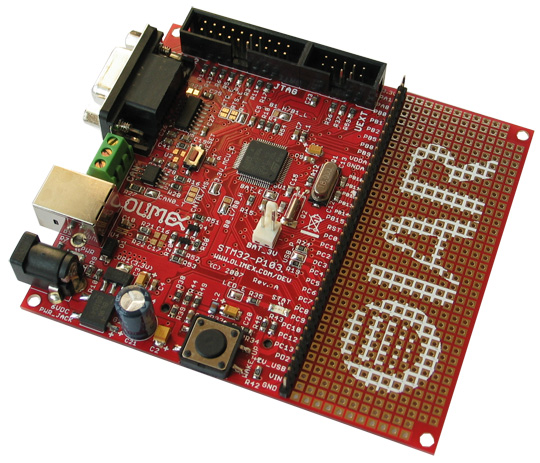
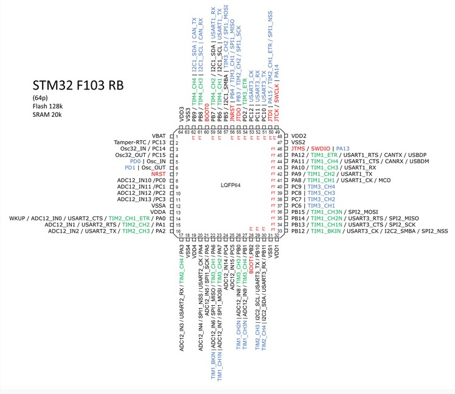

# Directorio con demos para la placa stm32-p103.

Este directorio contiene un conjunto de ejemplos de código de Beckus que puedan funcionar con la placa STM32-p103 en el simulador QEMU. Es importante mencionar que esta placa utiliza al micro SMT32F103RB, en consecuencia su pinout corresponde a dicha placa. A continuación se muestra una imagen de dicha placa.

Su datasheet se encuentra en el directorio &quot;Documentacion&quot;. El pinout de este micro es el siguiente

**Listado de los ejemplos de còdigo que funcionan en Qemu con el micro STM32-p103**

1. adc_single
2. Blink_flash
3. DAC (No entiendo como funciona)
4. FreeRTOS_Streambuffer
5. FreeRTOS_SingleThread
6. FreeRTOS_multithread
7. printf_demo
8. software_int
9. Systick
10. timer
11. uart_echo
12. uart_echo_int (funciona pero pierde caracteres)
14. uart_repeat_write
15. button
16. button_int